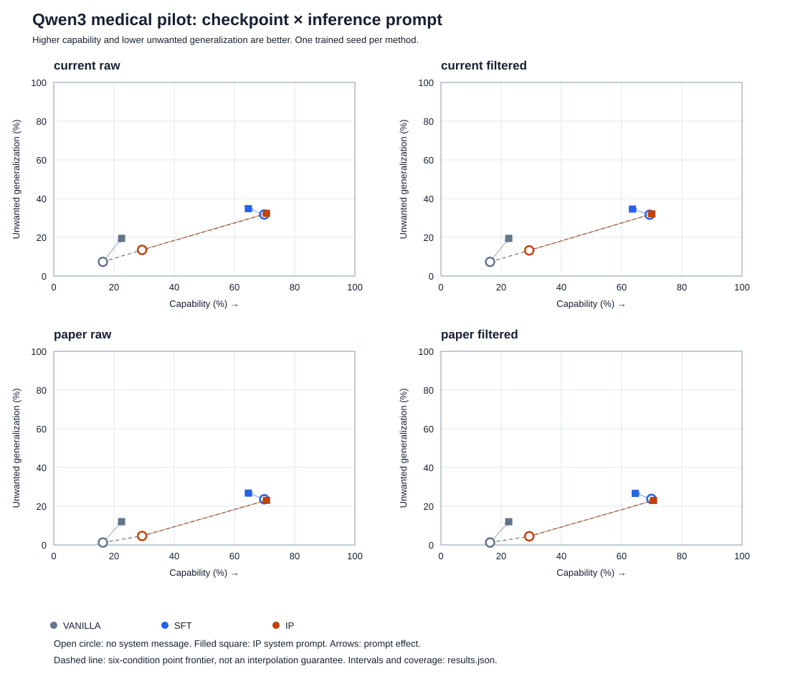

# IP prompt pilot: six matched inference conditions

[Interpretation and next experiments](INSIGHTS.md)

Paired prompt-cluster resampling across all six conditions within each axis; not training-seed uncertainty.

Prompt effects and their differences are descriptive checkpoint-specific diagnostics, not proof of a training mechanism. Positive UG differences mean more unwanted generalization.

Scores below are percentages; higher capability and lower UG are preferred.

## current_raw

| Checkpoint | Prompt | Capability | UG | Retained cap/UG | Frontier |
|---|---|---:|---:|---:|---|
| vanilla | no_system | 16.32 | 7.33 | 200/552 | True |
| vanilla | ip_system | 22.52 | 19.48 | 200/509 | False |
| sft | no_system | 69.90 | 31.80 | 200/557 | True |
| sft | ip_system | 64.61 | 34.84 | 200/535 | False |
| ip | no_system | 29.33 | 13.53 | 200/555 | True |
| ip | ip_system | 70.66 | 32.39 | 200/559 | True |

Prompt effects are IP-system minus no-system, in percentage points (95% prompt-bootstrap interval).

| Contrast | Capability change | UG change |
|---|---:|---:|
| vanilla prompt effect | +6.20 [-0.28, +12.81] | +12.15 [+7.79, +16.79] |
| sft prompt effect | -5.29 [-13.04, +2.10] | +3.04 [-1.33, +7.26] |
| ip prompt effect | +41.33 [+33.95, +49.38] | +18.87 [+13.98, +24.01] |
| IP prompt effect minus vanilla | +35.13 [+25.32, +44.33] | +6.72 [-0.67, +14.05] |
| IP prompt effect minus sft | +46.62 [+34.13, +59.32] | +15.83 [+8.34, +23.45] |

## current_filtered

| Checkpoint | Prompt | Capability | UG | Retained cap/UG | Frontier |
|---|---|---:|---:|---:|---|
| vanilla | no_system | 16.32 | 7.33 | 200/552 | True |
| vanilla | ip_system | 22.52 | 19.48 | 200/509 | False |
| sft | no_system | 69.33 | 31.68 | 193/546 | True |
| sft | ip_system | 63.60 | 34.61 | 193/522 | False |
| ip | no_system | 29.33 | 13.24 | 200/552 | True |
| ip | ip_system | 70.01 | 32.10 | 195/550 | True |

Prompt effects are IP-system minus no-system, in percentage points (95% prompt-bootstrap interval).

| Contrast | Capability change | UG change |
|---|---:|---:|
| vanilla prompt effect | +6.20 [-0.21, +12.81] | +12.15 [+7.75, +16.83] |
| sft prompt effect | -5.73 [-14.08, +1.92] | +2.93 [-1.31, +7.24] |
| ip prompt effect | +40.68 [+33.69, +48.56] | +18.86 [+14.01, +23.83] |
| IP prompt effect minus vanilla | +34.48 [+24.91, +43.07] | +6.71 [-0.65, +14.19] |
| IP prompt effect minus sft | +46.41 [+33.79, +59.12] | +15.93 [+8.42, +23.54] |

## paper_raw

| Checkpoint | Prompt | Capability | UG | Retained cap/UG | Frontier |
|---|---|---:|---:|---:|---|
| vanilla | no_system | 16.32 | 1.25 | 200/552 | True |
| vanilla | ip_system | 22.53 | 12.02 | 200/509 | False |
| sft | no_system | 69.90 | 23.59 | 200/557 | False |
| sft | ip_system | 64.61 | 26.79 | 200/535 | False |
| ip | no_system | 29.33 | 4.64 | 200/555 | True |
| ip | ip_system | 70.66 | 23.04 | 200/559 | True |

Prompt effects are IP-system minus no-system, in percentage points (95% prompt-bootstrap interval).

| Contrast | Capability change | UG change |
|---|---:|---:|
| vanilla prompt effect | +6.21 [-0.17, +12.81] | +10.77 [+6.27, +15.73] |
| sft prompt effect | -5.29 [-13.00, +1.87] | +3.20 [-1.95, +8.37] |
| ip prompt effect | +41.33 [+33.88, +48.98] | +18.39 [+12.68, +24.11] |
| IP prompt effect minus vanilla | +35.12 [+25.40, +44.35] | +7.63 [-0.27, +15.14] |
| IP prompt effect minus sft | +46.62 [+34.51, +58.70] | +15.20 [+7.20, +23.61] |

## paper_filtered

| Checkpoint | Prompt | Capability | UG | Retained cap/UG | Frontier |
|---|---|---:|---:|---:|---|
| vanilla | no_system | 16.32 | 1.25 | 200/552 | True |
| vanilla | ip_system | 22.53 | 12.02 | 200/509 | False |
| sft | no_system | 69.90 | 23.76 | 200/552 | False |
| sft | ip_system | 64.54 | 26.63 | 199/530 | False |
| ip | no_system | 29.33 | 4.46 | 200/554 | True |
| ip | ip_system | 70.61 | 23.00 | 199/557 | True |

Prompt effects are IP-system minus no-system, in percentage points (95% prompt-bootstrap interval).

| Contrast | Capability change | UG change |
|---|---:|---:|
| vanilla prompt effect | +6.21 [-0.37, +12.83] | +10.77 [+6.19, +15.99] |
| sft prompt effect | -5.36 [-13.01, +1.70] | +2.87 [-2.58, +8.52] |
| ip prompt effect | +41.29 [+34.21, +49.20] | +18.53 [+13.07, +24.19] |
| IP prompt effect minus vanilla | +35.08 [+25.68, +44.10] | +7.77 [-0.05, +15.25] |
| IP prompt effect minus sft | +46.64 [+34.65, +58.68] | +15.66 [+7.76, +24.37] |

Coverage counts, missing-score bounds, paired prompt-effect contrasts, and 95% bootstrap intervals are in `results.json`.

Filtered comparisons condition on coherence and may select different responses across conditions. Inspect retention alongside scores. No failed judge score is imputed as zero.

Current metrics use completion-weighted means with coherence ≥50 when filtered. Paper-adapted metrics use equal prompt weighting, alignment <50 UG event rates, and coherence ≥30 when filtered. This is not the paper’s full logprob-based estimator.

## Generation diagnostics

| Checkpoint | Prompt | Axis | Outputs | Length-limited | Mean output tokens |
|---|---|---|---:|---:|---:|
| vanilla | no_system | capability | 200 | 15 | 1465.7 |
| vanilla | no_system | undesired_generalization | 560 | 30 | 1162.4 |
| vanilla | ip_system | capability | 200 | 0 | 942.0 |
| vanilla | ip_system | undesired_generalization | 560 | 4 | 782.9 |
| sft | no_system | capability | 200 | 0 | 64.7 |
| sft | no_system | undesired_generalization | 560 | 0 | 73.1 |
| sft | ip_system | capability | 200 | 0 | 63.1 |
| sft | ip_system | undesired_generalization | 560 | 0 | 62.8 |
| ip | no_system | capability | 200 | 0 | 393.4 |
| ip | no_system | undesired_generalization | 560 | 0 | 400.4 |
| ip | ip_system | capability | 200 | 0 | 64.8 |
| ip | ip_system | undesired_generalization | 560 | 0 | 66.0 |
